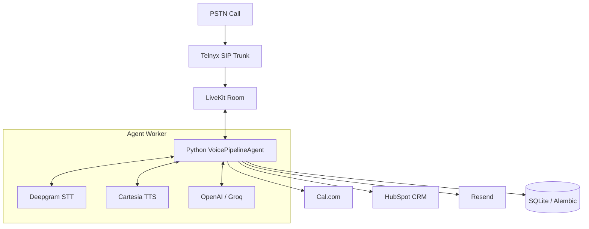

# LevelOne Voice Agent v2 — ALEX 🎙️

ALEX is the inbound voice AI agent for **LevelOne Digital Agency** (UK). Built to handle PSTN calls seamlessly, ALEX qualifies B2B leads in real-time, books discovery calls, and synchronizes data with the agency's CRM.

## ✨ Features

- **PSTN Telephony:** Inbound and outbound calling via Telnyx SIP Trunk.
- **Real-Time Voice:** Sub-second latency powered by LiveKit and WebRTC.
- **Advanced Conversational AI:**
  - **Speech-to-Text (STT):** Deepgram (nova-3)
  - **Text-to-Speech (TTS):** Cartesia (sonic-english)
  - **LLM Brain:** OpenAI GPT-4o / Groq Llama with an intelligent routing layer.
- **B2B Qualification:** Guides callers through a BANT-light framework (6 stages) with a warm, British persona.
- **Automated Workflows:**
  - **Scheduling:** Checks availability and books slots directly via the Cal.com API.
  - **CRM Sync:** Upserts contacts, deals, and logs call notes in HubSpot.
  - **Notifications:** Sends booking confirmations and follow-ups via Resend.
- **Admin Dashboard:** Real-time analytics, call history, and configuration management built into the FastAPI backend.

## 🏗️ Architecture



## 🛠️ Tech Stack

- **Framework:** FastAPI (Python 3.11+)
- **Voice Infra:** LiveKit (Self-hosted on Contabo VPS)
- **Database:** SQLite / PostgreSQL (async via SQLAlchemy + Alembic)
- **Package Manager:** [uv](https://github.com/astral-sh/uv)

## 🚀 Getting Started

### Prerequisites

- Python 3.11+
- `uv` installed (`curl -LsSf https://astral.sh/uv/install.sh | sh`)
- A LiveKit server running (local or remote)
- API keys for OpenAI, Cartesia, Telnyx, Cal.com, HubSpot, and Resend.

### Installation

1. **Clone the repository** and navigate to the project directory.

2. **Configure Environment:**
   ```bash
   cp .env.example .env
   # Edit .env with your specific API keys and configuration
   ```

3. **Install Dependencies:**
   ```bash
   uv sync
   ```

4. **Initialize the Database:**
   ```bash
   uv run alembic upgrade head
   ```

### Running Locally

You need to run both the FastAPI server (for webhooks/admin) and the LiveKit Agent worker.

**Terminal 1: FastAPI Webhook & Dashboard**
```bash
uv run python -m app.main
```
*The admin dashboard will be available at `http://localhost:8000/dashboard`*

**Terminal 2: LiveKit Agent Worker**
```bash
uv run python -m app.agent.worker
```

## 📦 Deployment

The project is designed to be deployed on a Linux VPS (e.g., Contabo) using `systemd`.

1. Make sure your production `.env` is configured on the server.
2. Deploy the code using the provided script:
   ```bash
   python deploy_vps.py
   ```
3. Sync the database with Alembic on the VPS (safe, runs only once or when schema changes):
   ```bash
   cd /opt/voice-agent
   .venv/bin/alembic stamp head
   ```
4. Check the status of the services:
   ```bash
   systemctl status voice-agent voice-webhook
   ```

### Production Infrastructure & Access

*   **Reverse Proxy:** Caddy handles incoming SSL connections on port `7880`.
*   **Webhooks & Dashboard Routing:** All routes starting with `/api*`, `/dashboard*`, and `/health*` are proxy-passed by Caddy to the FastAPI backend running locally on port `8080`.
*   **Dashboard URL:** `https://agent.leveloneagency.co.uk:7880/dashboard`
*   **Telnyx Webhook URL:** `https://agent.leveloneagency.co.uk:7880/webhook/telnyx`

## 🧠 LLM Router Configuration

The agent uses a smart routing system to delegate tasks (e.g., conversation, summarization, intent extraction) to different LLM providers (OpenAI, Groq). This is configurable via the Admin Dashboard or directly in the database.

## 🤝 Contributing

- Keep the architecture clean (Hexagonal / Screaming Architecture principles where applicable).
- Ensure new integrations are isolated in their own modules under `app/`.
- Database schema changes must be handled via Alembic: `uv run alembic revision --autogenerate -m "description"`.
